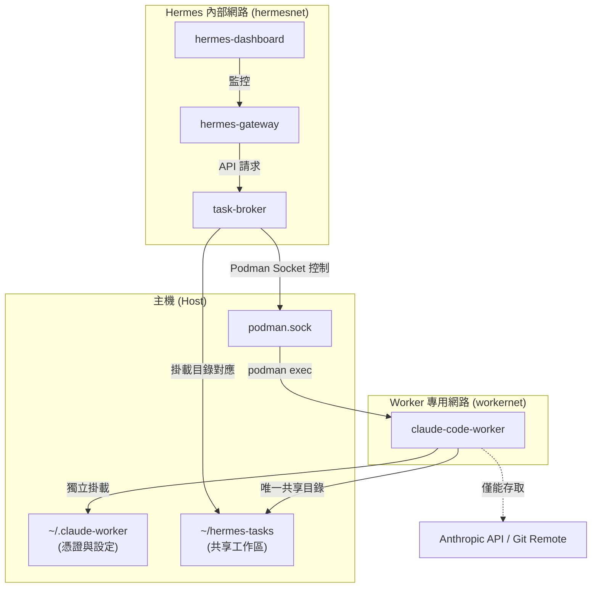

# hermes-podman

以 Podman Compose 無根（rootless）方式執行 [NousResearch Hermes Agent](https://hub.docker.com/r/nousresearch/hermes-agent)。

## 服務

| 服務 | 容器名稱 | 連接埠 | 說明 |
|------|----------|--------|------|
| `hermes` | `hermes-gateway` | `8642` | API 閘道 |
| `dashboard` | `hermes-dashboard` | `9119` | 網頁管理介面 |
| `task-broker` | `task-broker` | `8777` (內部) | 任務調度代理，為唯一的 Worker exec 閘道，負責審查任務與控制預算 |
| `claude-worker` | `claude-code-worker` | - | 獨立的重型任務 Worker，預載 Claude Code，僅接受 Podman exec 呼叫 |

- `hermes` 與 `dashboard` 服務均掛載 `~/.hermes` 至容器內的 `/opt/data`，作為持久化資料目錄。
- `claude-worker` 掛載主機的 `~/.claude-worker` 作為獨立的家目錄與憑證儲存空間。
- `claude-worker` 與 `task-broker` 共享 `~/hermes-tasks` 目錄作為專案工作區（容器內的 `/work`）。

## Claude Code Worker 整合設計

為了安全地處理重型程式碼編寫與測試任務，本專案新增了基於 Claude Code Worker 的代理授權架構。此設計實現了沙盒隔離與最小權限原則：



- **單一控制閥 (task-broker)**：`task-broker` 持有 Podman Socket，為唯一能夠控制 Worker 的通道。它負責限制任務類型、執行時長與預算上限。
- **網路沙盒隔離 (workernet)**：`claude-code-worker` 與 Hermes Gateway 隔離在不同網段，不開放任何連入埠（ports）。Worker 僅能透過單獨的 `workernet` 與外界通訊。
- **檔案系統最小化存取**：Worker 無法存取主機的家目錄或 `~/.hermes` 設定，僅能讀寫掛載的 `~/hermes-tasks` 工作目錄，確保主機機密資訊不外洩。

詳細設定與建置步驟請參考 [DEPLOY.md](file:///home/icekimo/gitWrk/hermes-podman/DEPLOY.md)。

## 環境需求

- [Podman](https://podman.io/)
- [podman-compose](https://github.com/containers/podman-compose)

## 快速開始

```bash
# 首次啟動前，需建置自訂 Worker/Broker 映像檔
./podman-compose build

# 啟動所有服務
./podman-compose up -d

# 停止所有服務
./podman-compose down

# 重新啟動單一服務
./podman-compose restart hermes

# 查看日誌
./podman-compose logs -f hermes
./podman-compose logs -f task-broker

# 拉取最新映像檔
./podman-compose pull
```

> **注意**：請使用專案內的 `./podman-compose` 包裝腳本，而非系統的 `podman-compose`。
> 該腳本會自動帶入 `--in-pod 0` 參數，以確保 `userns_mode: keep-id` 正常運作。

## 資料目錄

所有執行期資料與設定存放於主機：

### Hermes 相關
| 路徑 | 內容 |
|------|------|
| `~/.hermes/config.yaml` | 主要設定檔 |
| `~/.hermes/.env` | 機密資訊 / API 金鑰 |
| `~/.hermes/logs/` | 閘道與代理日誌 |
| `~/.hermes/skills/` | 已安裝的技能 |
| `~/.hermes/plugins/` | 已安裝的外掛 |

### Claude Code Worker 相關
| 路徑 | 內容 |
|------|------|
| `~/.claude-worker/` | Claude Worker 的獨立家目錄（包含憑證、狀態與 CLAUDE.md 設定） |
| `~/hermes-tasks/` | 任務工作目錄（主機與 Worker 的唯一共享儲存區） |

## 安全說明

- `userns_mode: keep-id`：容器以主機使用者身份（UID 1000）執行，無需 root 權限。
- `user: "1000:1000"`：明確指定容器內的執行使用者。
- Volume 掛載加上 `:Z` SELinux 標籤，適用於啟用 SELinux 的系統。
- 容器不具備特權模式（無 `privileged: true`）。
- **容器與網路隔離防線**：
  - `claude-code-worker` 沒有對外暴露任何 Port，且位於獨立的 `workernet`，與 `hermesnet` 隔絕，無法被 Hermes 代理直接以網路橫向存取。
  - 僅 `task-broker` 容器掛載了 rootless podman 的 Socket，並作為唯一的代理閘道，透過 `podman exec` 對 Worker 下達指令。
  - 建議於主機端限制 `workernet` 的出口流量（Egress），僅允許存取 Anthropic API 與 Git Host（詳細做法請參見 [DEPLOY.md](file:///home/icekimo/gitWrk/hermes-podman/DEPLOY.md)）。
- **檔案權限與沙盒邊界**：
  - Worker 僅掛載了指定的 `~/hermes-tasks` 作為專案工作目錄，其餘主機敏感目錄對 Worker 均為不可見，保護主機檔案安全。

